# Servidor Web Apache - Linux

Se pretende obtener un conjunto de sitios web similares a los realizados en IIS, es decir, algo semejante a lo siguiente:

    Dominio principal: miempresa.com (o similar)
    Alias página principal: www.miempresa.com
    Sitio seguro (https): pagos.miempresa.com (o miempresa.com/pagos)
    Carpetas privadas protegidas: empleados.miempresa.com (o miempresa.com/empleados)
    Instalación PHP, MySQL, phpMyAdmin
    Gestión bases de datos: phpmyadmin.miempresa.com (o miempresa.com/phpmyadmin)
    Instalación FTP o SSH (opcional)
    Instalación y configuración plataforma Drupal, Joomla, Moodle, Gallery, osCommerce, etc. en página principal

## Para ello tienes que seguir los siguientes pasos.

## Apache:
        * Instalar Apache: sudo apt-get install apache2

        * Comprobar acceso a localhost

        * Añadir línea www.miempresa.com asociada a IP servidor en /etc/hosts.

         Comprobar acceso.

        * Reiniciar apache: sudo /etc/init.d/apache2 restart.

## PHP:
        * Instalar php: sudo apt-get install php5

        * Comprobar acceso a index.php -<?php phpinfo(); ?>-.
        Para ello copiamos el fichero index y lo renombramos como **index.php** y añadimos el codigo **<?php phpinfo(); ?>**

          * Comprobamos la pagína.

        * sudo apt-get install libapache2-mod-php5.

## Crear Hosts Virtuales en Apache, es decir, asociar carpetas con sitios web.

        * Creamos empleados.miempresa.com --> /var/www/empleados.

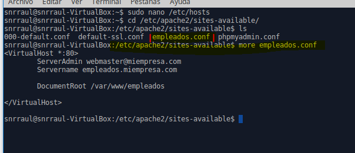

        * Configuramos los Hosts Virtuales.

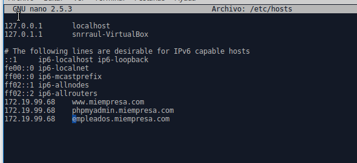

        * Activamos las pagínas.

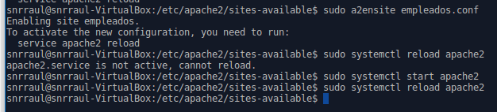

        * Comprobamos la pagína.

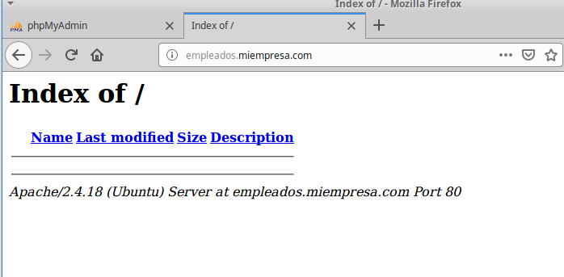

## Configurar sitio web seguro pagos:

    Al instalar Apache, se instala también SSL
    Generar certificado autofirmado:
      *  § openssl genrsa -des3 -out server.key 1024

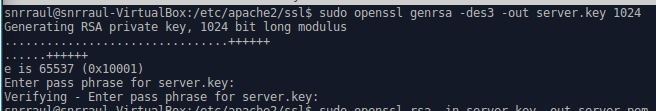

      *  § openssl rsa -in server.key -out server.pem

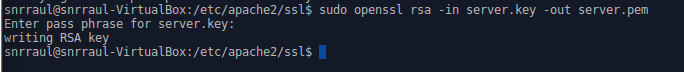

      *  § openssl req -new -key server.key -out server.csr

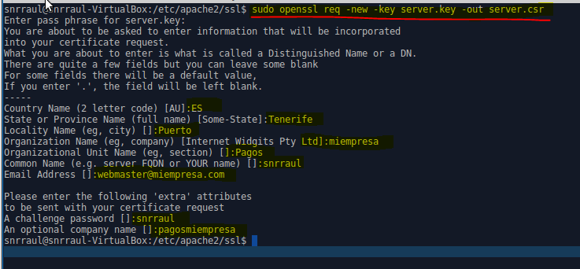

      *  § openssl x509 -req -days 360 -in server.csr -signkey server.key -out server.crt

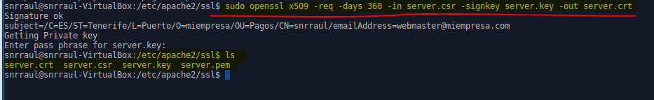

## Modificar /etc/apache2/sites-available/000-default.conf según indicaciones PDF para crear host virtual seguro.

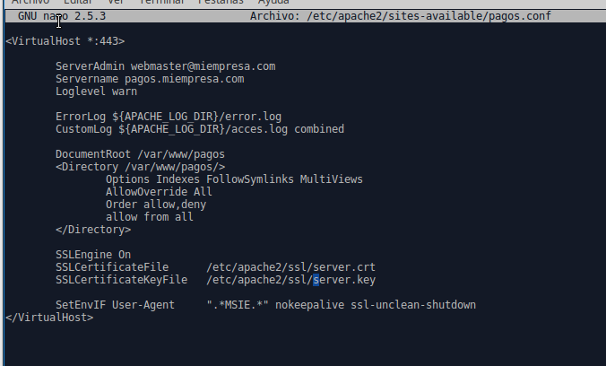

      * Creamos el host.

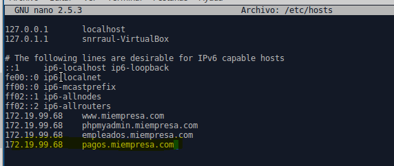

      * Reiniciar el sitio.

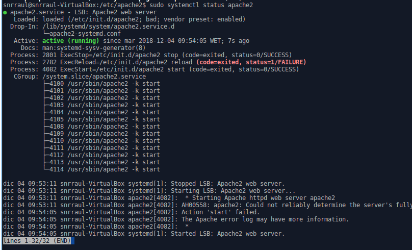

      * Comprobar el sitio.

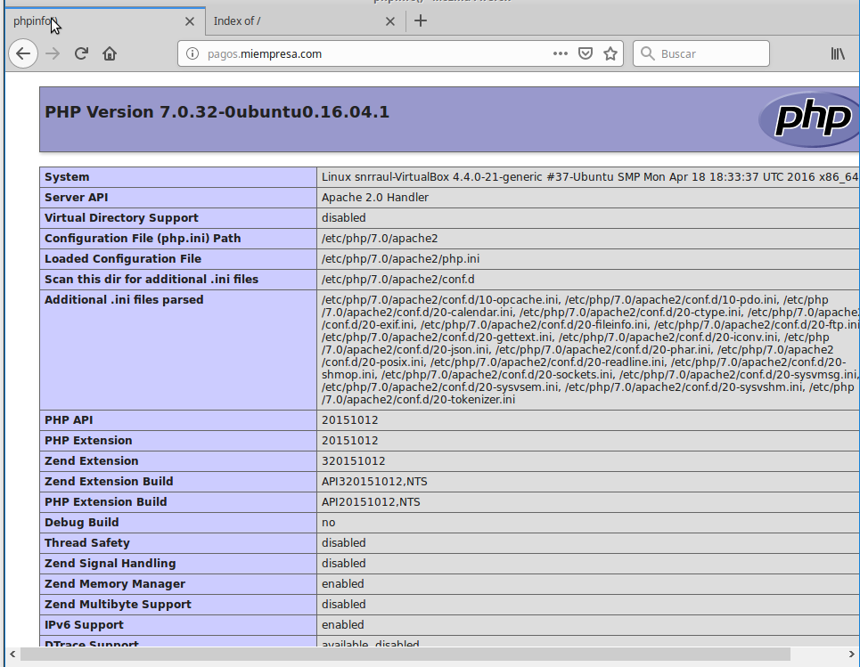

## Acceso a carpetas privadas

    **Autenticación mediante .htaccess:**
    * Estructura: empleados.miemepresa.com (acceso a todos los empleados pero no anónimos).
    * Creamos el directorio **claves** y el fichero **htpaswwd** con la configuración.

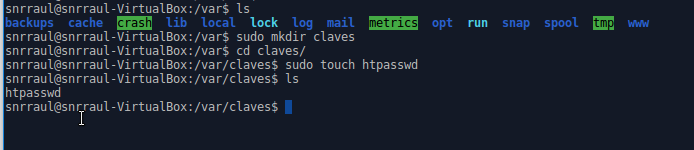

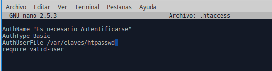

    * Creamos los usuarios **Pepe y Arminda**.

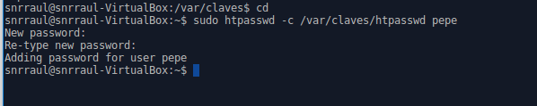

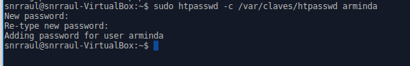

    * Creamos el archivo de VirtualHost para el sitio Pagos.

    * Añadimos pagos.miempresa.com a /etc/hosts.

    * Reiniciamos el servicio Apache2.

    * Comprobamos que la pagína funciona.

## MySQL
    * Instalar MySQL: sudo apt-get install mysql-server.

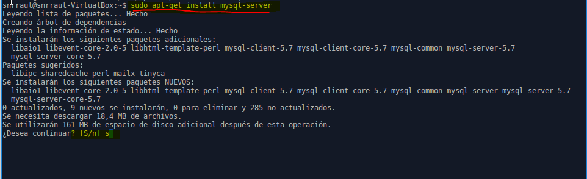

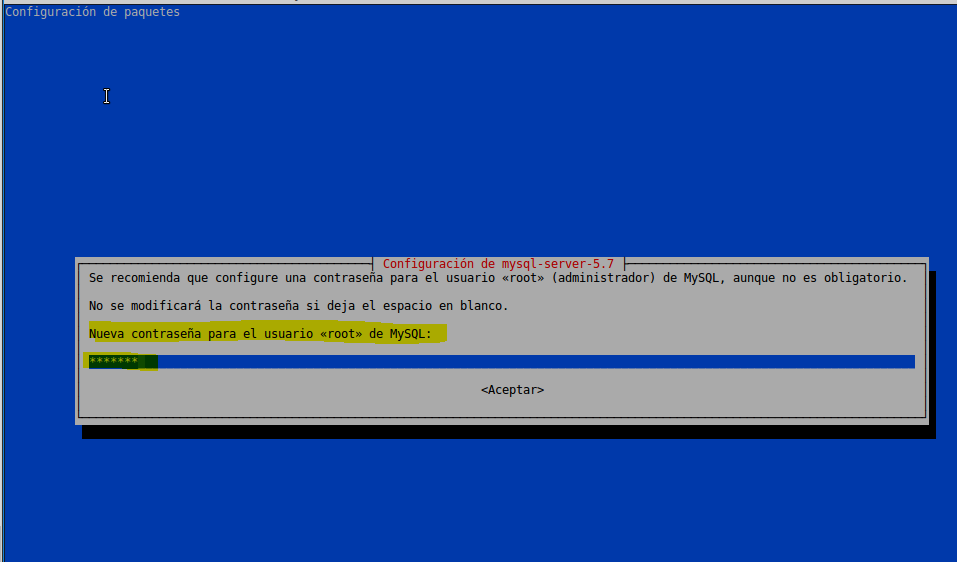

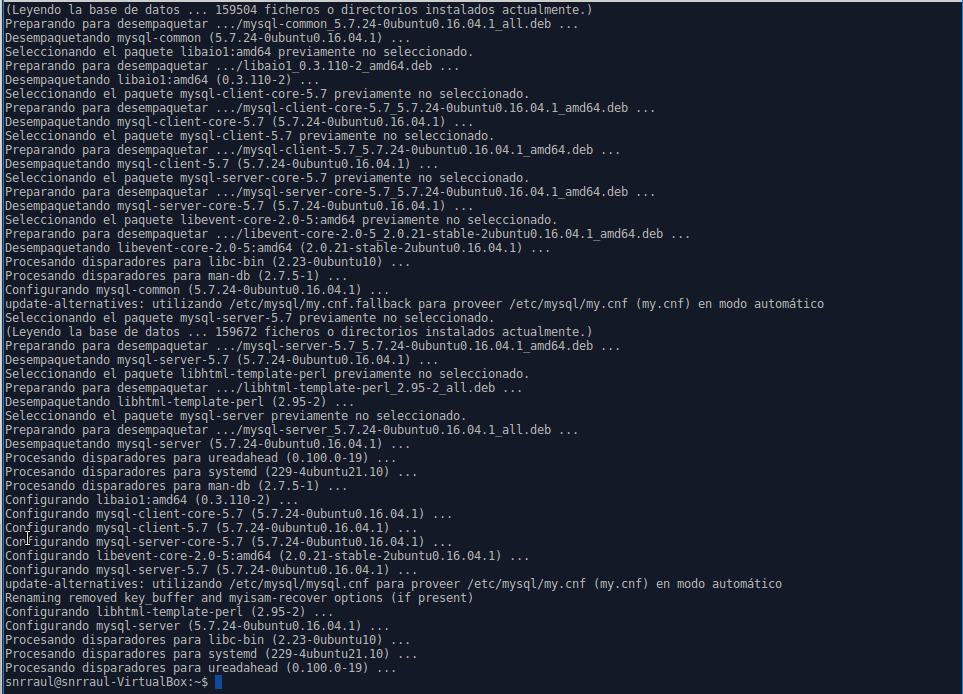

## phpMyAdmin
    * Descargar última versión (tar.gz) desde phpmyadmin.net.

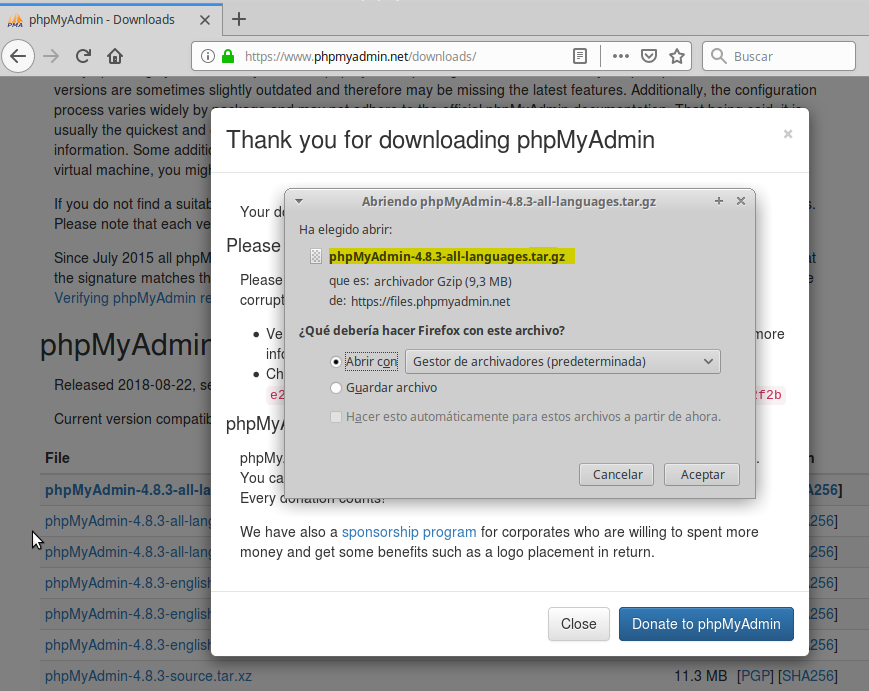

    * Cremos la carpeta phpmyadmin en /var/www.

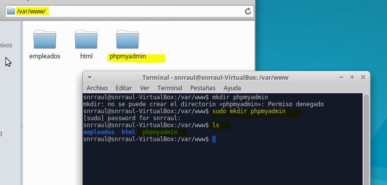

    * Descomprimir en subcarpeta de /var/www.

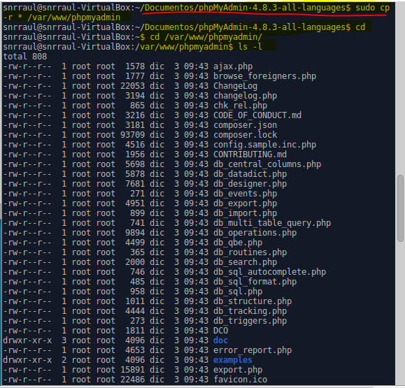

    * Añadimos a /etc/hosts phpmyadmin.

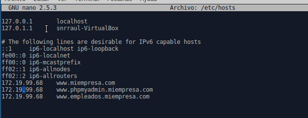

    * Creamos el VirtualHost de phpmyadmin.

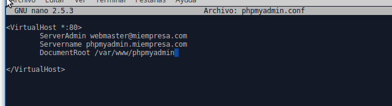

    * Activamos el fichero y reiniciamos el servicio apache2.

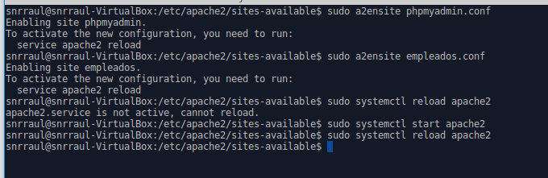

    * Comprobar acceso.

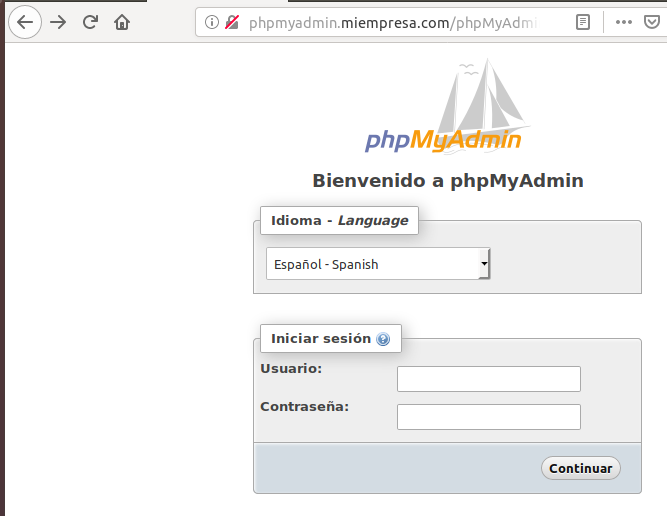
