# Servidor Web Apache - Linux

Se pretende obtener un conjunto de sitios web similares a los realizados en IIS, es decir, algo semejante a lo siguiente:

    Dominio principal: miempresa.com (o similar)
    Alias página principal: www.miempresa.com
    Sitio seguro (https): pagos.miempresa.com (o miempresa.com/pagos)
    Carpetas privadas protegidas: empleados.miempresa.com (o miempresa.com/empleados)
    Instalación PHP, MySQL, phpMyAdmin
    Gestión bases de datos: phpmyadmin.miempresa.com (o miempresa.com/phpmyadmin)
    Instalación FTP o SSH (opcional)
    Instalación y configuración plataforma Drupal, Joomla, Moodle, Gallery, osCommerce, etc. en página principal

## Para ello tienes que seguir los siguientes pasos.

## Apache:
        * Instalar Apache: sudo apt-get install apache2

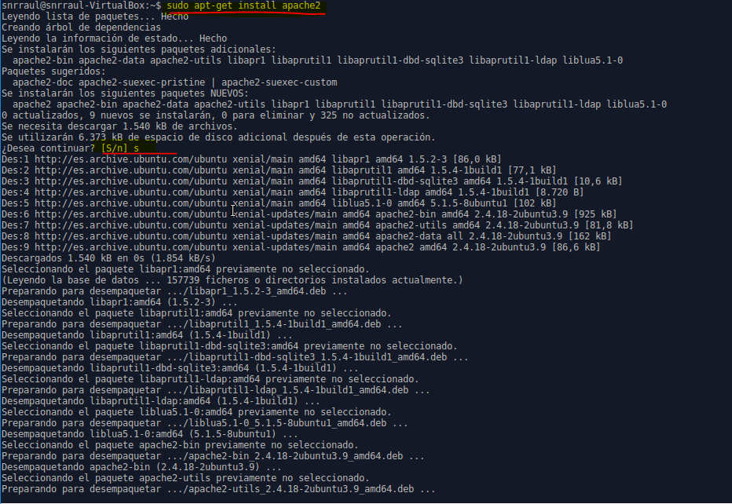
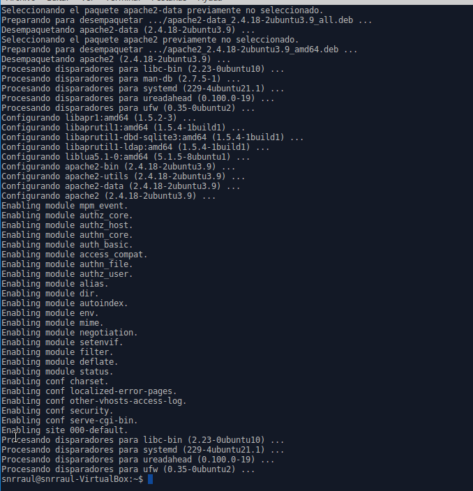

        * Comprobar acceso a localhost

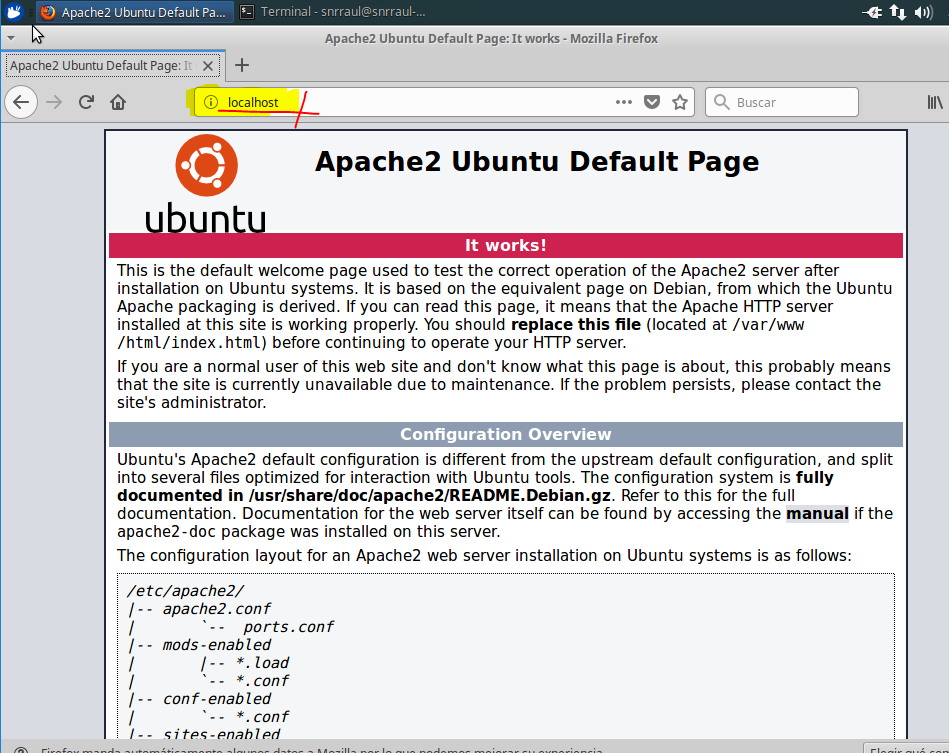

        * Añadir línea www.miempresa.com asociada a IP servidor en /etc/hosts.

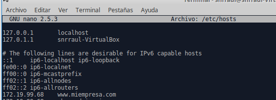

         Comprobar acceso

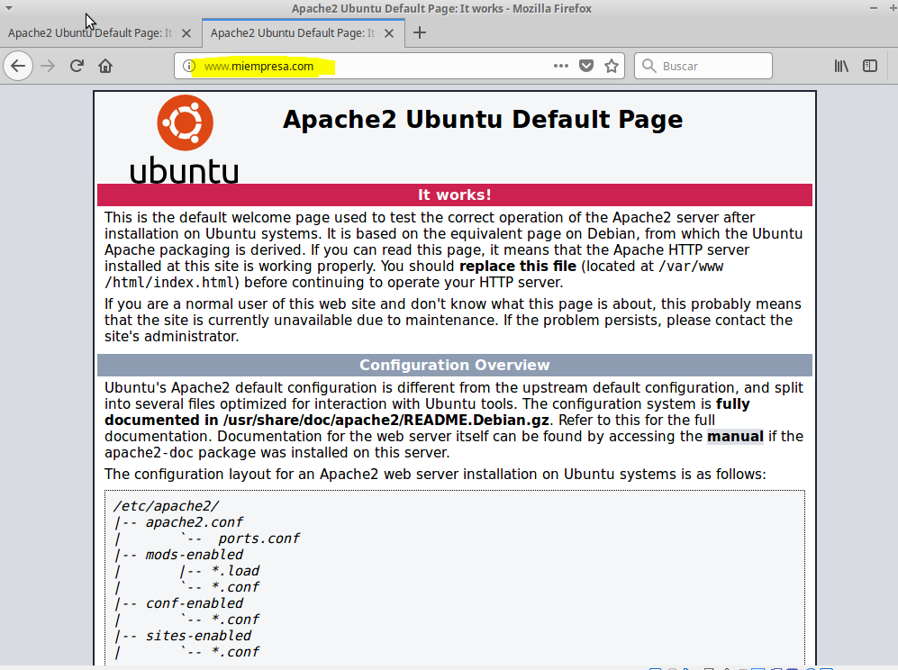

        * Reiniciar apache: sudo /etc/init.d/apache2 restart.

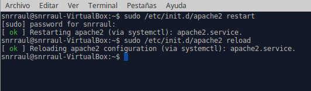

## PHP:
        * Instalar php: sudo apt-get install php5

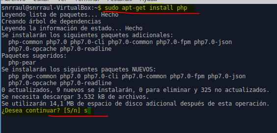

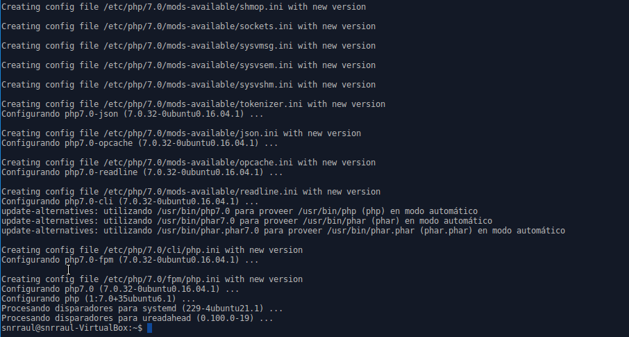

        * Comprobar acceso a index.php -<?php phpinfo(); ?>-.
        Para ello copiamos el fichero index y lo renombramos como **index.php** y añadimos el codigo **<?php phpinfo(); ?>**

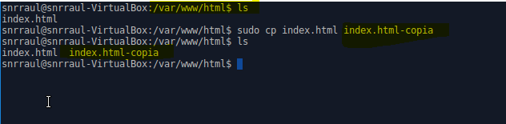

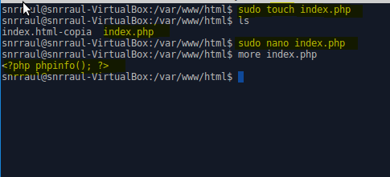

          * Comprobamos la pagina.

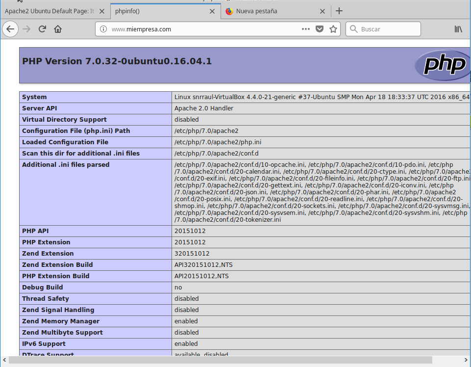

        * sudo apt-get install libapache2-mod-php5.

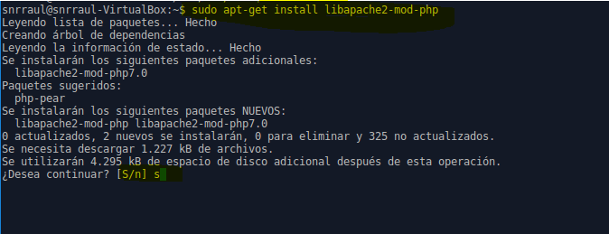

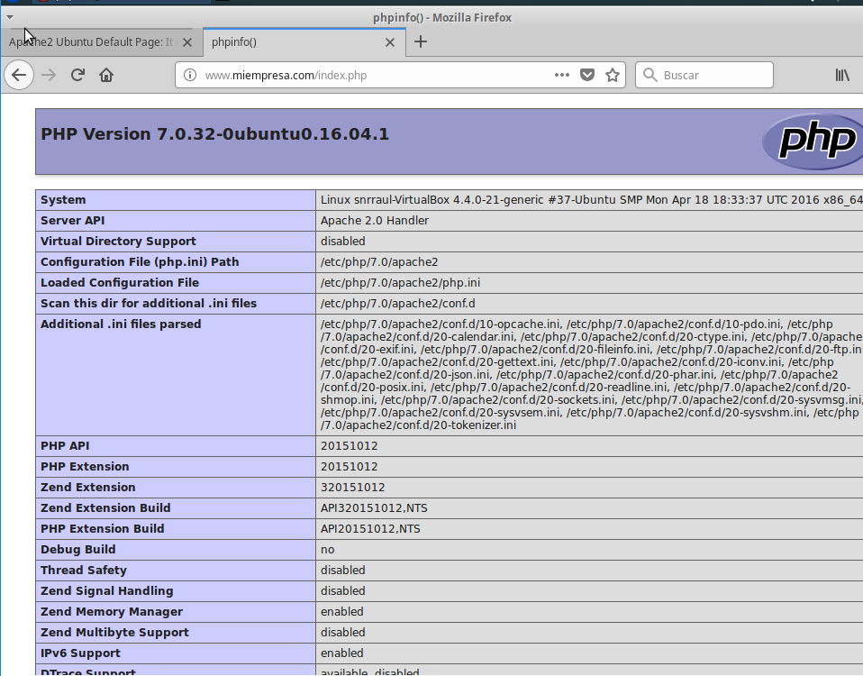

## Crear Hosts Virtuales en Apache, es decir, asociar carpetas con sitios web.

Creamos empleados.miempresa.com --> /var/www/empleados
