# Instalación y configuración de servidor DNS Linux bind9

En esta práctica vamos a instalar y configurar un servidor DNS bind9 en una máquina Linux.

Para ello, debemos de seguir los siguientes apartados:

## 1. Indicar a Linux que el servidor DNS es él mismo (/etc/resolv.conf).
Vamos al fichero /etc/resolv.conf y agregamos la ip del servidor, esto indicará que el servidor DNS es él mismo.

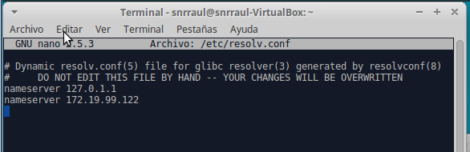

Instalamos bnd9.

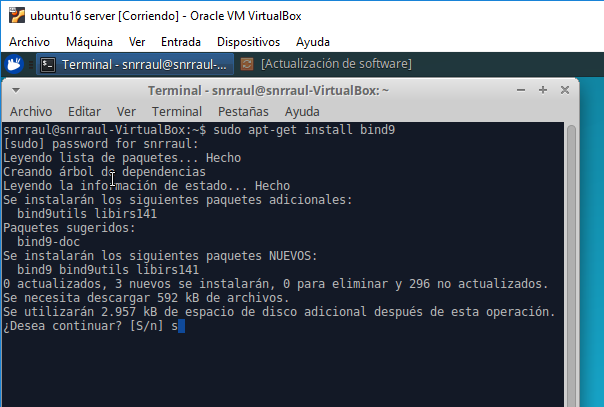

## 2. Configurar servidor como caché DNS (/etc/bind/named.conf.options) con reenviadores de DNS con DNS públicos.

Después de instalar bind9, vamos al fichero /etc/bind/named.conf.options y ponemos la IP de los reenviadores.

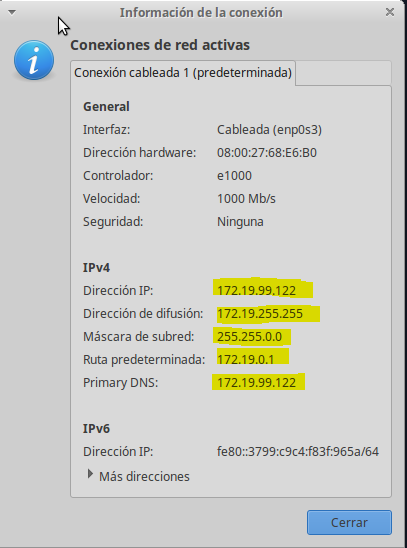

## 3. Comprobar resolución de nombres externos, tanto desde el servidor como desde un cliente al que le preste servicio DNS.

Comprobamos la resolución de nombres utilizando el comando nslookup.

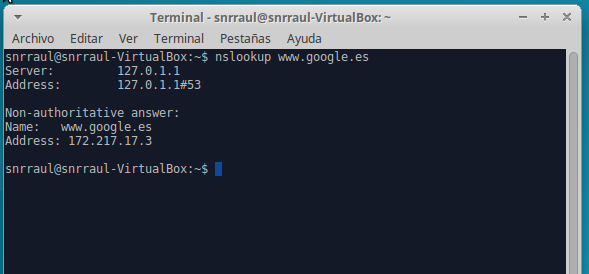

Vamos a la máquina cliente y le indicamos que el servidor DNS es el del servidor.

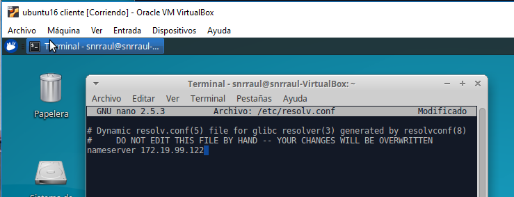

Comprobamos la resolución de nombres desde el cliente.

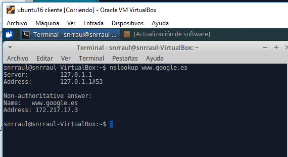

## 4. Configurar como DNS maestro instalando un dominio ficticio (tu empresa virtual) y añadiendo configuración para búsquedas de zona directa y zona inversa.

Ahora, configuramos como DNS maestro mediante la Instalación de un dominio ficticio, y añadiendo configuraciones para búsqueda de zona directa y zona inversa en el fichero /etc/bind/named.conf.local

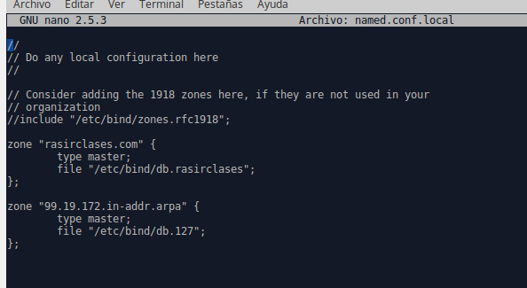

## 5. Crear un archivo de búsqueda directa y otro de búsqueda inversa, similares a los que se muestran en el manual, con los registros que consideres oportunos. Utiliza la configuración básica incluida en los archivos db.local (directa) y db.127 (inversa).

Creamos el archivo de búsqueda directa.

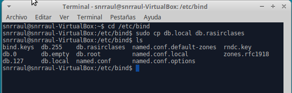

Esta es su configuración:

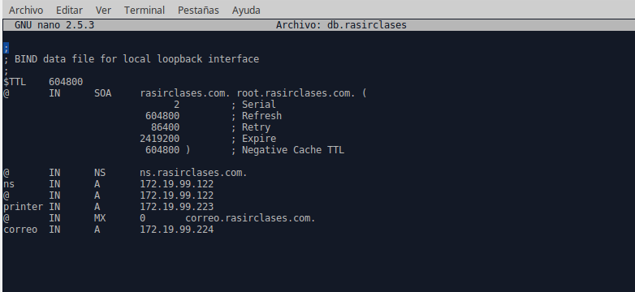

Reiniciamos el servicio bind9.

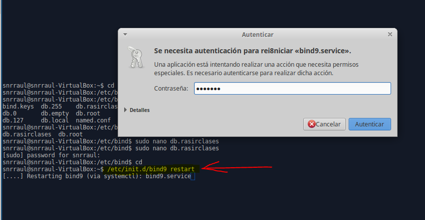

Creamos el archivo de búsqueda inversa.

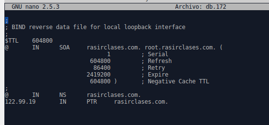

Reiniciamos el servicio bind9 nuevamente.

## 6. Comprobar que se resuelven los nombres desde la consola del servidor.
Volvemos a comprobar que todo funciona perfectamente, resolviendo los nombres desde la consola del servidor.

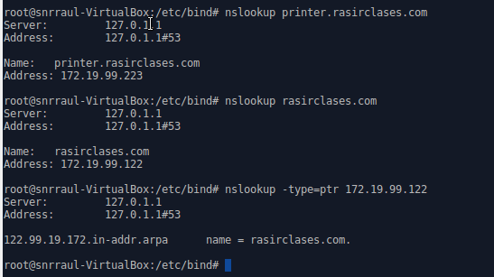

Para que nuestra máquina utilice el servidor de DNS que hemos configurado, debemos editar “/etc/resolv.conf” y dejamos únicamente la línea que aparece en la captura:

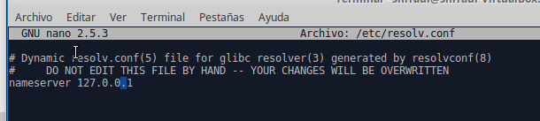

Deberíamos hacer lo mismo con el resto de máquinas de la intranet que vayan a utilizar el servidor, con la única diferencia que habrá que substituir la IP 127.0.0.1 por la IP que tenga el servidor en la red.

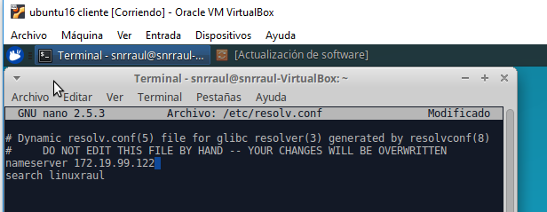

Creamos el archivo de configuración /etc/bind/sb.192 a partir del archivo /etc/bind/db.127

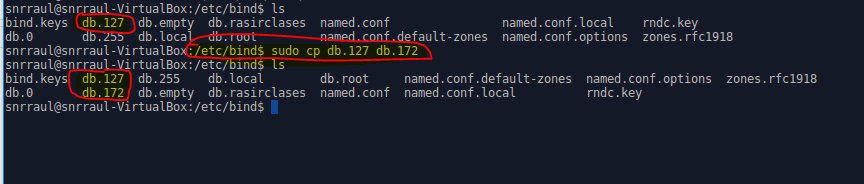

Editamos /etc/bind/db.192 y sustituimos “localhost” por “rasirclases.com” y cambiamos la última línea que indica la IP 172.19.99.122 escrita a la inversa y omitiendo el 172.

## 7. Comprobar desde la consola del cliente que se resuelven correctamente los nombres dados de alta en el servidor (aunque en algunos casos, si se trata de direcciones ficticias, no se obtenga respuesta).

Podemos comprobar su funcionamiento reiniciando el demonio bind9 y realizando una consulta.

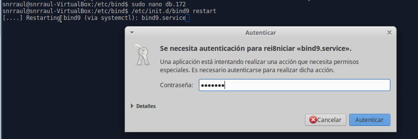

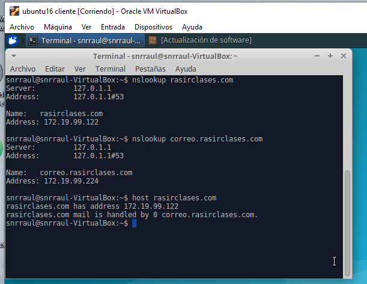
