 # Instalación y Configuracón DNS Windows Server

Crear zona de búsqueda directa para el servidor, la llamamos zona1.rasirclases.com.

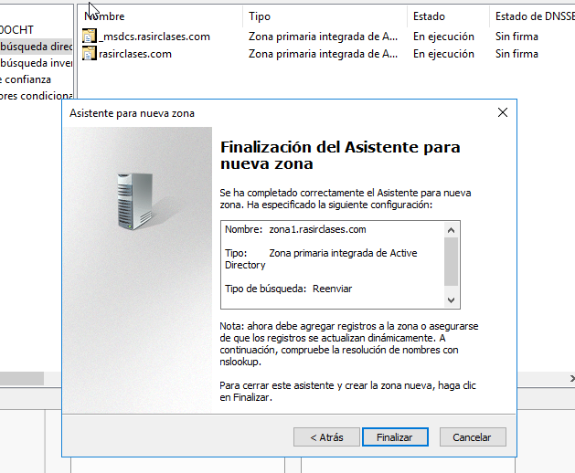

Crear zona de búsqueda inversa para subred, añadimos la id de la red para que identifique las subredes.
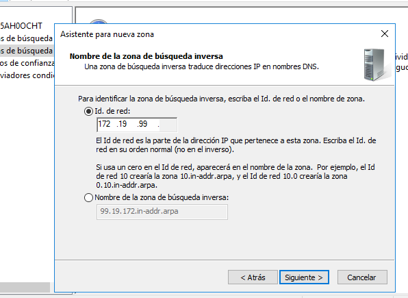

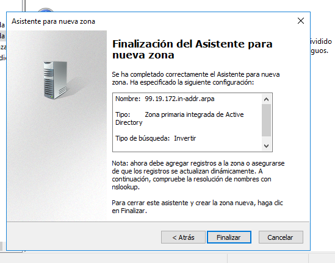

Configuramos los reenviadores con DNS público (195.235.113.3 / 80.58.61.250 / 8.8.8.8).

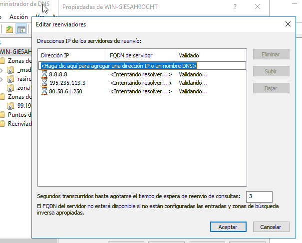

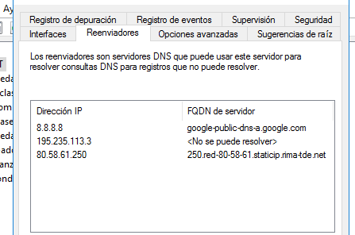

Configuramos el servidor para ser servidor DNS Caché.
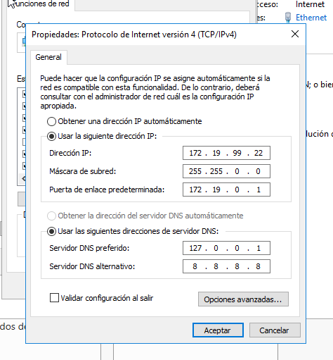
Comprobar el funcionamiento como caché DNS de la máquina al acceder a sitios de Internet.
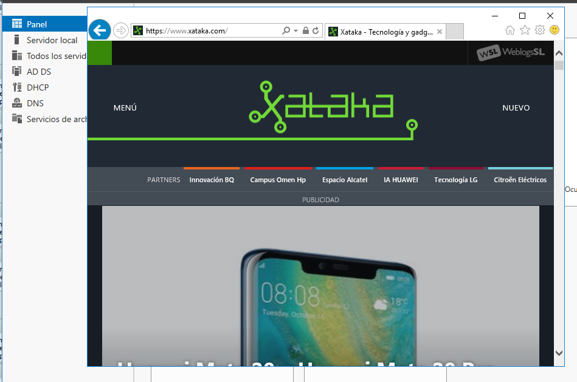

Configurar cliente para que su servidor DNS sea el servidor W2016.
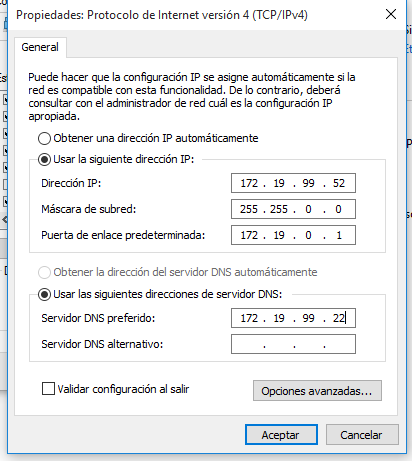

##### En la zona de búsqueda directa añadir los siguientes registros:

* Un alias para el servidor denominado server.
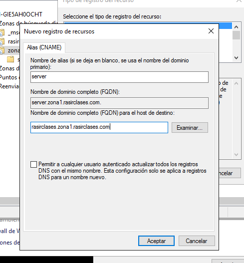

* Una impresora con IP fija denominada printer (no hace falta alias).
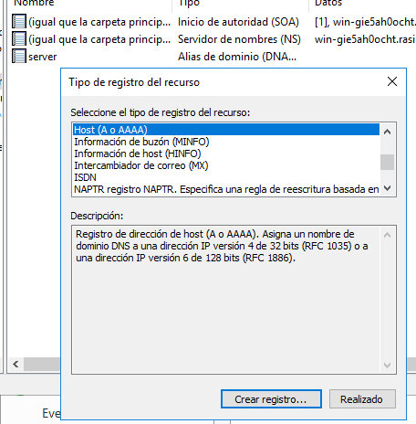

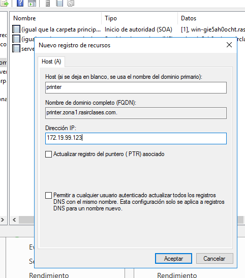
* Un servidor de correo (ficticio) denominado correo, asociado a una dirección en tu servidor.

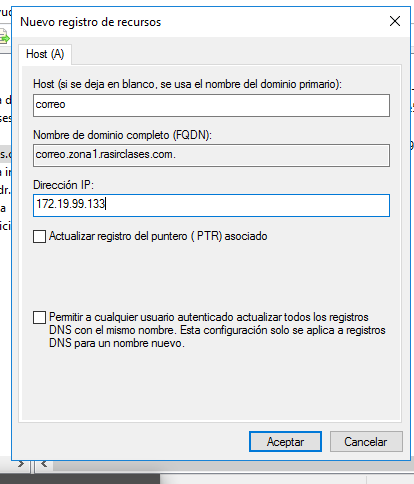

Hacemos un registro de recursos nuedo **(MX)**
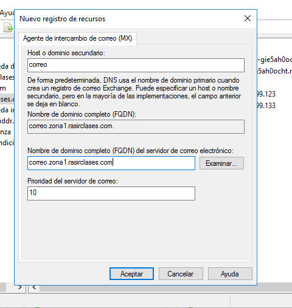

* Crear una subzona denominada servicios (dominio nuevo).

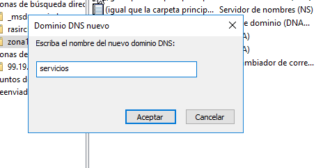

 * Agregar un servidor ftp (asociado a la misma IP del servidor) .

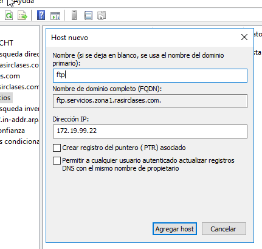

 * Una impresora nueva (con una IP fija).

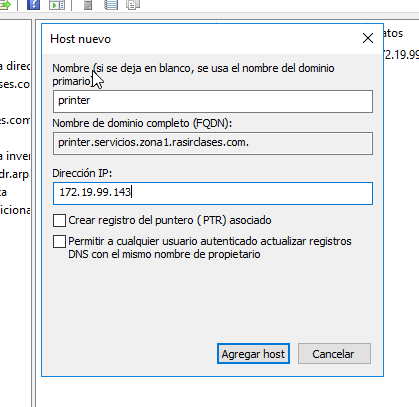

* Equipo del administrador del sistema (también con IP fija).

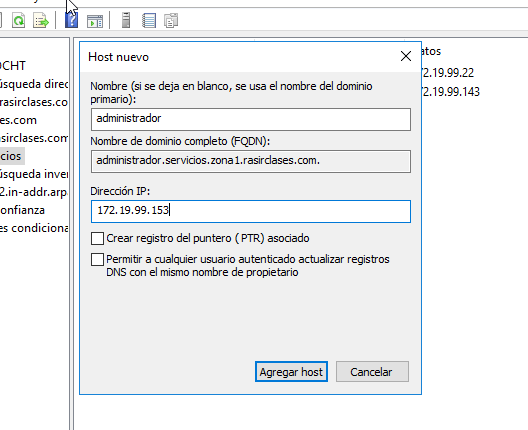

Comprobamos que se ha creado todo correctamente.

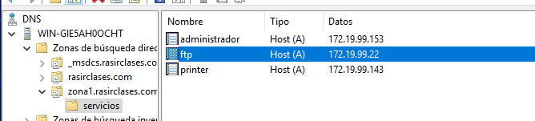

###### Comprobamos que se resuelven los nombres desde la consola del servidor.

 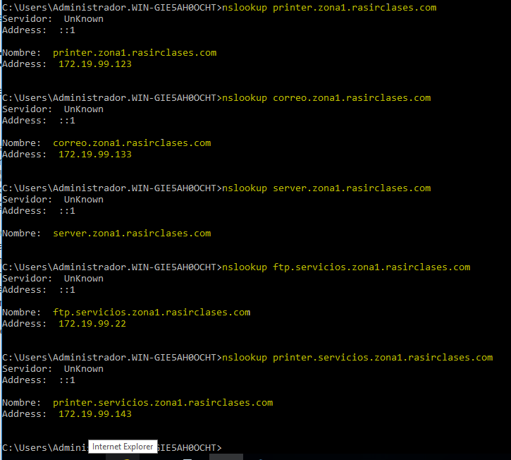

 Validamos un cliente en el dominio.

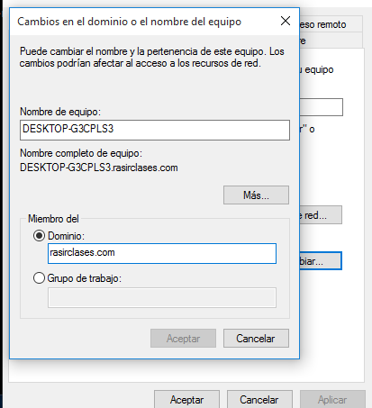

 Comprobamos que el nombre de su equipo aparece en la zona de búsqueda del servidor como un nuevo registro A.

 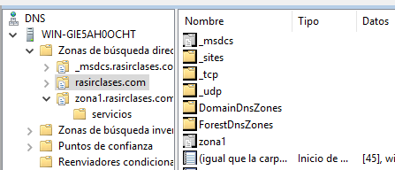

 Comprobar desde la consola del cliente que se resuelven correctamente los nombres dados de alta en el servidor (aunque en algunos casos, si se trata de direcciones ficticias, no se obtenga respuesta).

 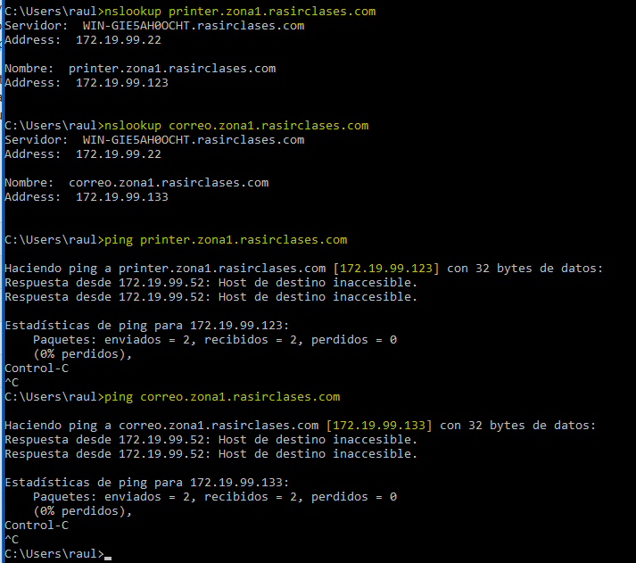

 Realizar, también desde el cliente, algunas operaciones con nslookup tanto dentro como fuera de nuestra intranet.

 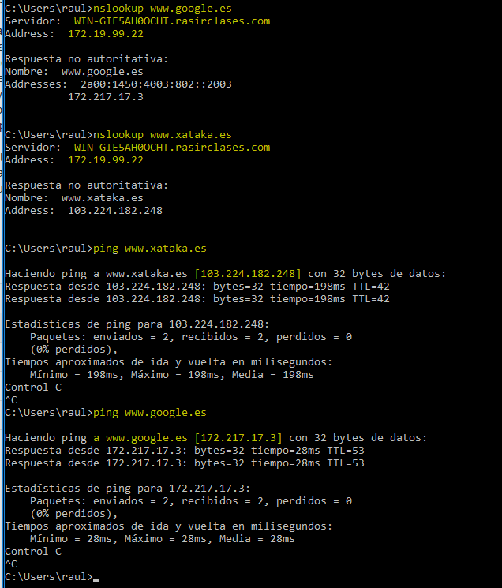
