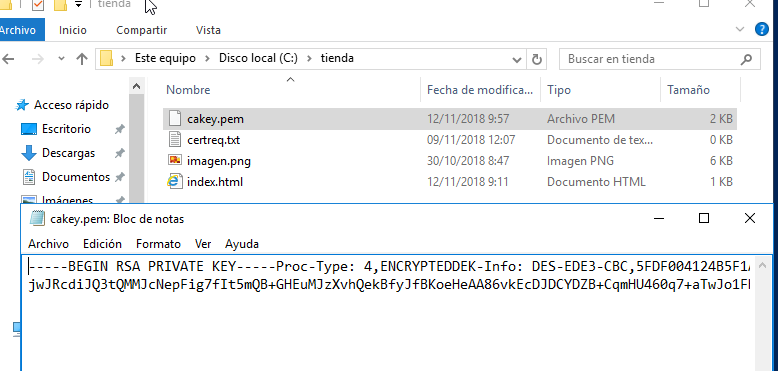
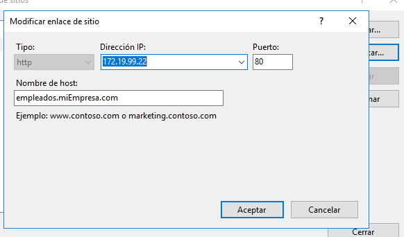
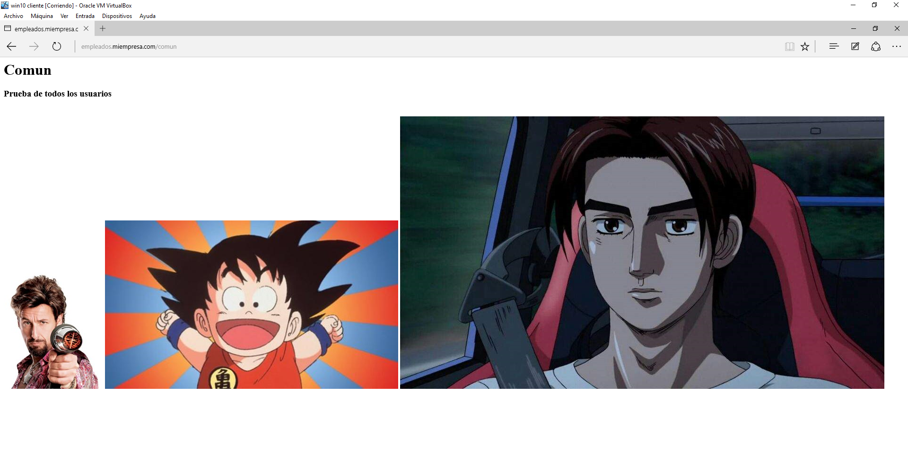

# Instalación y Configuración de un servidor Web Avanzado

### Informe I
## Carpetas seguras

Creamos una nueva zona de búsqueda directa en los servicios DNS asociada al dominio miEmpresa.

Creamos también una carpeta miEmpresa en C:\ y una subcarpeta **principal**.

Creamos un nuevo sitio web denominado miEmpresa en IIS asociado a la subcarpeta anterior y con acceso a través de la dirección www.miEmpresa.com.

Creamos un  nuevo  sitio web (denominado ‘pagos’) como subdominio de **miEmpresa(pagos.miEmpresa.com)** y configura este último para ser accedido de forma segura, vía ‘https’.

Creamos el sitio web, con la configuración adecuada en IIS y en los servicios DNS.

Comprobamos el acceso (aún vía ‘http’) con un navegador desde el propio servidor y desde un cliente W7.

**Configuración A:** Seguimos los pasos del tutorial y configuramos el nuevo sitio  para que se pueda acceder (sólo) como sitio web seguro (https) con un Certificado Autofirmado.

* Creamos el certificado.

* Agregamos pagos como sitio seguro (https) y lo comprobamos.

**Configuración B:** Creamos un nuevo sitio seguro **(tienda.miempresa.com)** con la generación de un Certificado Digital a través de la aplicación  **OpenSSL.**

Realizaremos la solicitud de un nuevo certificado de servidor para nuestro sitio seguro y creamos el  fichero **certreq.txt** para alojar la solicitud.

Descargamos e instalamos OpenSSL para Windows.

A través de OpenSSl generamos un nuevo certificado de servidor.

Generamos una clave privada de la entidad certificadora.

Creamos un certificado digital de la entidad certificadora y finalmente, crear un certificado digital de nuestra web.

* Comprobamos.

Importamos el nuevo certificado de servidor creado para completar la petición pendiente en nuestro sitio seguro ‘pagos’.

* Configuramos el DNS.

Requerimos que a nuestros sitios seguros sólo se pueda acceder mediante una conexión segura y reiniciamos los sitios web.
* Tienda

* Pagos

* Comprobamos que se ha creado el SSL correctamente.

Finalmente, accedemos mediante http y mediante https a los sitios seguros desde el propio servidor y desde un cliente W7, aceptando los posibles problemas con la entidad certificadora.

* Comprobamos *pagos*.

* Comprobamos *tienda*.

* Comprobamos *pagos* desde el *cliente*.

* Comprobamos *tienda* desde el *cliente*.

### Informe II

## Carpetas Privadas

Necesitamos crear una carpeta empleados (dentro de miEmpresa).

Dentro de esta, tres o cuatro subcarpetas personales con nombres de empleados y una, denominada común, a la que tendrán acceso todos los empleados, pero no otros usuarios sin identificar.

Colocamos un fichero index.html diferente en cada una de las carpetas creadas, con el objetivo de poder comprobar el acceso desde un navegador.

Crearemos el nuevo sitio web, como subdominio de nuestro dominio principal, asociado a la carpeta genérica empleados.

* Le añadimos la Ip (antes no la habia puesto).

Añadimos al DNS principal el subdominio.

Para el sitio web creado y para cada una de sus carpetas, deshabilitamos el acceso anónimo *(al deshabilitarlo en el sitio web, por defecto lo hace en las carpetas).*

Agregamos la función de Autenticación Básica a nuestro Servicio de IIS a través de la Administración del Servidor.

En Active Directory, crearemos un usuario para cada empleado (tantos como carpetas personales) y un grupo Empleados que los incluya a todos.

**Grupo empleados**

**Usuario Goku**

**Usuario Zohan**

**Usuario Takumi**

Añadimos y comprobamos los usuarios en el grupo.

Desactivamos, para la carpeta **empleados**, los permisos heredables a través de las opciones avanzadas en la ficha de seguridad.

Añadimos grupo de Administradores con Control Total.

Grupo Empleados con Lectura y Ejecución+ Mostrar Carpeta+Leer.

Realizamos el mismo procedimiento para cada una de las carpetas personales de los empleados, colocando como usuarios autorizados el  **Grupo de Administradores (Control Total)**

* Takumi.

* Goku.

* Zohan.

Y **el empleado propietario de cada carpeta** (con los permisos que creas convenientes).

 * Takumi.

 

 * Goku.

 

 * Zohan.

 

Realizamos el mismo procedimiento para la carpeta ‘comun’, colocando como usuarios autorizados el **Grupo de Administradores (Control Total)**

* Común Administradores.

Y el **grupo  Empleados** (con los permisos que creas convenientes).

* Común Empleados.

 

Comprobamos el acceso, tanto **desde el servidor**.

* Comprobación de Goku.

* Comprobación de Zohan.

* Comprobación de Takumi.

* **Acceso a comun con Zohan**

Como **desde el cliente**, a las diferentes carpetas con distintos usuarios.

* Comprobación de Goku.

* Comprobación de Zohan.

* **Acceso a comun con Goku**

