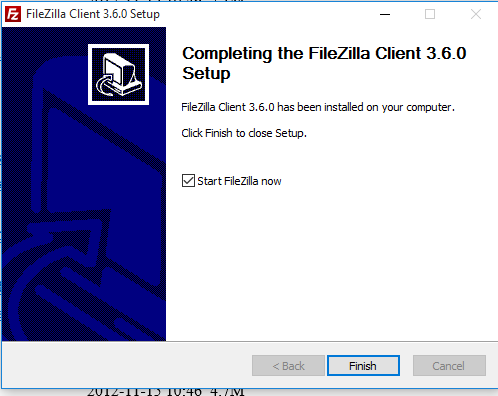
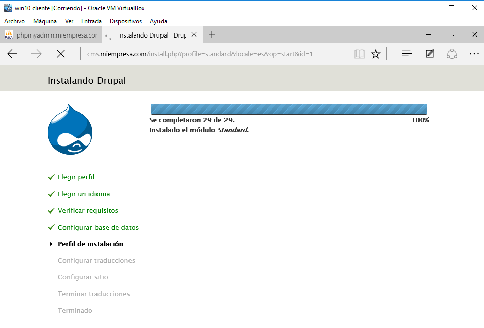
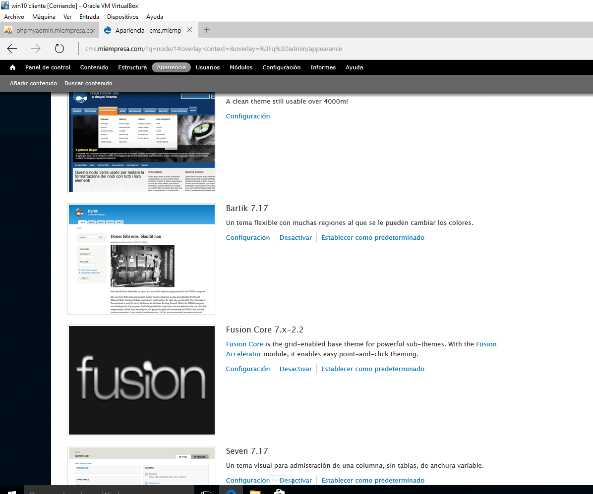

# Instalación y Configuración de un Servidor Web Avanzado

#  Instalación de PHP, MySQL y PHPMyAdmin

### realizar las instalaciones y configuraciones necesarias para obtener un Servidor Web con soporte PHP y accesos a bases de datos relacionales, acceso FTP y gestor de bases de datos. Sobreeste servidor, podremos realizar instalaciones de aplicaciones integradas (CMS, e-commerce, etc) desde el propio servidor o en modo remoto desde un cliente W7.

##### Instalar PHP

Utilizando MSI Installer para Windows: Descargar archivo Installer en
http://windows.php.net/download/ y seguir los pasos (ver
http://www.php.net/manual/es/install.windows.installer.msi.php).

Al instalar nos da un fallo diciendo que es necesario instalar CGI.

Para ello agregamos el o caracteristica CGI.

Continuamos con la instalacion de PHP hasta completarla.

Configurar luego IIS para
que admita el fichero index.php por defecto en las carpetas y/o sitios que nos interese.

Para ello añadimos el codigo **<?php phpinfo(); ?>** siguiente al index de la pagina y cambiar el .html por **.php**.

Comprobamos el funcionamiento.

### Siguiendo los pasos detallados en las guías y tutoriales, instala el servidor de bases de datos relacionales MySQL para tus sitios Web gestionados por IIS. Descargar para ello el paquete instalador de http://dev.mysql.com/downloads/installer/.
* Descargar e instalar .NET Framework 4.0.

* Instalar MySQL y complementos necesarios.

Configuramos la contraseña.

Dejamos el nombre por defecto.

Instalación completada.

### Siguiendo los pasos detallados en las guías y tutoriales, instala PHPMyAdmin para tus sitios Web gestionados por IIS. Para esto debes crear un nuevo sitio web asociado a phpmyadmin.miEmpresa.com, recordando crear la correspondiente carpeta (donde descomprimirás los ficheros de phpMyAdmin) y actualizar DNS.

Para ello creamos la carpeta de sitio **PHPMyAdmin**.

Creamos el sitio web en IIS.

Configuramos el servicio dns.

Descomprimimos **PHPMyAdmin** en la carpeta que hemos creado.

Comprobamos desde el navegador.

Iniciamos la sesion con root y la contraseña configurada al instalar MySQL.

//////////////////////////////////////////////////////////
# **INFORME II**
//////////////////////////////////////////////////////////

# Instalación de Servidor FTP y CMS Drupal

Siguiendo los pasos detallados en las guías y tutoriales proporcionados:
* Instalar Servidor FTP FileZilla en Windows 2012 Server.

* Crear un usuario denominado ftpuser en el Servidor FTP y asociarle a este usuario permisos de Control Total sobre la carpeta en la que se va a instalar el CMS de miEmpresa.

Creamos el usuario.

Iniciamos el Filezilla.

Agregamos el usuario al ftp con control tota.

* Crear un nuevo registro DNS que permita acceder a nuestro sitio FTP a través de la dirección
ftp.miEmpresa.com.

**A partir de este punto, salvo problemas de difícil solución, todo el trabajo deberá realizarse en
modo remoto, desde el cliente Windows 7:**

* Comprobar acceso a phpMyAdmin desde un navegador (phpmyadmin.miEmpresa.com).

* Comprobar el acceso al sitio FTP creado a través de un navegador y con el usuario ftpuser.

* Instalar un cliente ftp (p.e.: FileZilla) en Windows 7 para poder realizar todas las operaciones
sobre los ficheros y carpetas del servidor web.

* Descargar CMS Drupal de drupal.org, descomprimir y subir archivos Drupal a carpeta principal (www.miEmpresa.com).

* Crear una nueva base de datos, denominada cms, a través de phpMyAdmin.

* Crear usuario cms y asignar todos los privilegios para la base de datos anterior.

* Instalar CMS Drupal desde el navegador siguiendo los pasos y consultando documentación
en Internet

## Configuración y creación del sitio Drupal:

* Configurar idioma español; instalar módulo gtranslate y habilitar traducción a varios idiomas;

**Configuramos el acceso a la base de datos con el usuario cms.**

**Configuramos el sitio**

#### Drupal instalado correctamente.

    * Instalar y configurar temas Marinelli, Zen y Fusion;

**Descargamos los temas y los descomprimimos, luego los subimos vía FTP por Filezilla desde la conexión del servidor hasta la ruta del cliente.**

    * Configuramos el tema como principal.

      * Crear dos o tres páginas de contenido.

**Comprobamos las paginas creadas.**

* Crear menú Primary Links y colocar como
bloque. Otras opciones de configuración que desees.

** Creamos el Bloque y lo ponemos como encabezado.**

**Comprobación.**

