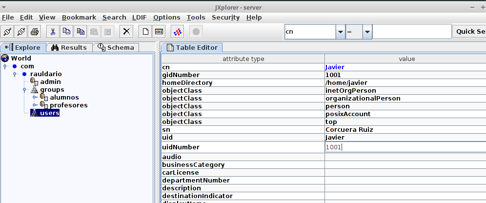

# INSTALACIÓN Y CONFIGURACIÓN SERVIDOR LDAP

## Instalar paquete LDAP apt-get install slapd

## Instalar librerias apt-get install db4.8-util ldap-utils

## Configurar LDAP dpkg-reconfigure slapd

## Nombre de dominio DNS

## Nombre de la organización

## Contraseña de administrador

## Motor de la base de datos

## Protocolo LDAPv2

## DPKG configurado

## Arranque y parada del Servidor LDAP

# Administración LDAP, usar JXplorer

## Instalar JDK 7

## Instalar JXplorer

## Ejecutar JXplorer en Herramientas de Desarrollo

## Conexión JXplorer

## Unidad organizativa Usuarios

## Unidad organizativa Profesores

## Creación de Usuarios y configuración

## Cambiamos el id del grupo a los Usuarios

## Añadimos la contraseña a los Grupos

## Añadimos la contraseña a los Usuarios

# Instalación y Configuración de Carpetas Privadas en Apache con autenticación LDAP:

## Habilitar módulos Apache2 LDAP, a2enmod ldap; a2enmod authnz_ldap

## Crear carpeta privada en /var/www con fichero index.html

## Crear nuevos sitios virtual es en /etc/apache2/sites-available/default con configuración de autenticación LDAP, añadir línea   AuthBasicProvider ldap en cada VirtualHost

**Usuario**

**Grupo**

## Sitio virtual privado de usuario y otro de acceso para grupo

## Accedemos a la página e iniciamos sesión con el Grupo
**Por errores que no podemos solucionar, no inicia la sesión**

## Accedemos a la página e iniciamos sesión con el usuario

