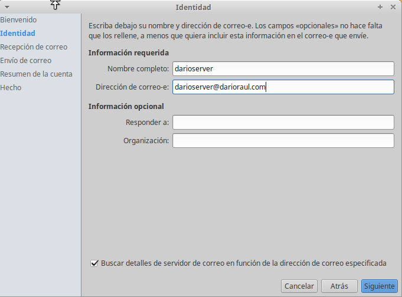
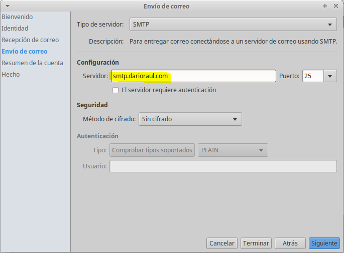
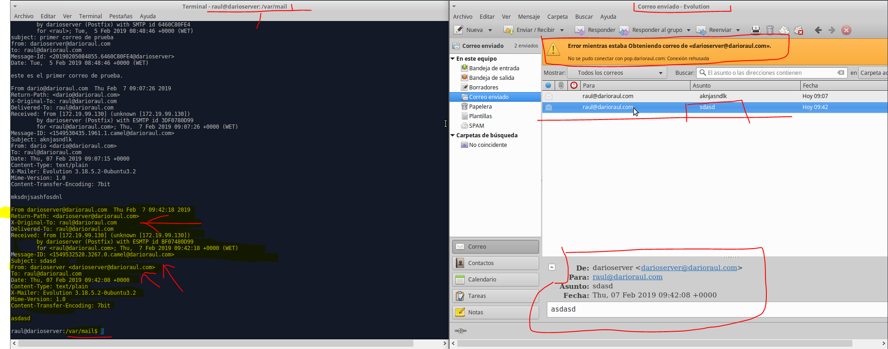

# Instalación y configuración de un servidor de correo

## Instalar servicio SMTP en Linux, utilizando el servidor Postfix.

  * Descargar e instalar postfix: apt-get install postfix.

  

  * Configuración de postfix:
    * Escoger instalación como Sitio de Internet

      

    * Crear dominio miempresa.com o similar

      

    * finalización de la instalación de postfix.

      

  * Comprobar servicio (y puerto) SMTP activo y a la escucha con netstat–utap.

  

  * Realizar  una  prueba  de  envío  de  mensaje  entre  dos  usuarios  del  sistema  mediante telnet,  tal  y  como  se  indica  en  el  ejemplo  del  apartado Prueba  de  Funcionamientodel documento pdf.

  

  * comprobamos que recibió el mensaje.

  

  * Instalar  un  cliente  de  correo  electrónico  en  un  cliente  (por  ejemplo Evolution,  para Ubuntu).

  

  * Crear  dos  nuevas  entradas  en  /etc/hosts:  smtp.miempresa.com  y  pop.miempresa.com asociadas a la IP del servidor.

  

  * Crear al menos dos cuentas asociadas a usuarios existentes en el servidor y asociadas al dominio creado en Postfix.

  

  * Configurar datos de las cuentas (dirección correo, servidores entrante y saliente).

  

  

  

  

  

  

  

  

  * Ahora añadimos el segundo usuario en evolution.

  

  

  

  

  

  * Realizar  envío  de  dos  correos,  uno  con  cada  una  de  las  cuentas  creadas.  Comprobar  la recepción de estos correos en el servidor examinando la carpeta /var/mail.

  

  

  

## Instalar servicio IMAP y servidor Correo Web SquirrelMail:

* Instalar servicio IMAP con apt-get install dovecot-imapd.

  

* Comprobar servicio (y puerto) IMAP activo y a la escucha con netstat –utap.

  

* Instalar aplicación correo web SquirrelMailcon apt-get install squirrelmail.

  

* Carpeta de configuración en /etc/squirrelmail.

  

* Carpeta de aplicación en /usr/share/squirrelmail.

  

* Copiar lineas no comentadas /etc/squirrelmail/apache.conf en un nuevo fichero .conf de /etc/apache2/sites-available, habilitar sitioy reiniciar apache.

  

* Creamos enlace simbólico del fichero.

  

* Reiniciamos apache.

  

* Acceder vía HTTP en /localhost/squirrelmail.

  

**En este último apartado nos ha dado fallo con el fichero de configuración y nos da el error anteriormente visto en la captura**

* Acceder desde una máquina cliente, vía HTTP, al gestor de correo SquirrelMail instalado.
* Enviar  y  recibir  correos  entre  las  dos  cuentas  creadas  desde  el  cliente  y  utilizando  el gestor de correo web SquirrelMail.
* Comprobar que los mensajes enviados desde ambas cuentas se siguen encontrando en los respectivos buzones de los usuarios en /var/mail.

## Instalar servicio POP3:

* Instalar servicio POP3 con apt-get install dovecot-pop3d.

  

* Comprobar servicio (y puerto) POP3 activo y a la escucha con netstat –utap.

  

* Configurar  MUA  (gestor  de  correo  cliente  Evolution  o  similar)  en  máquina  cliente  para que  acceda  a  la  recepción  de  correo  a  través  del  protocolo  POP3  instalado  en  el servidor.

  

  

  

* Enviar  y  recibir  correos  entre  las  dos  cuentas  creadas  desde  el  cliente  y  utilizando  el gestor de correo del cliente.

  

  

* Verificamos que los correos llegaron.

  

  
