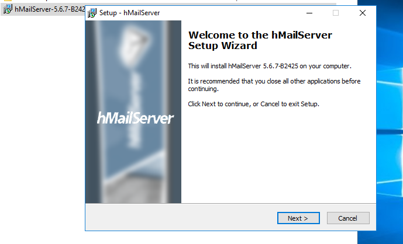
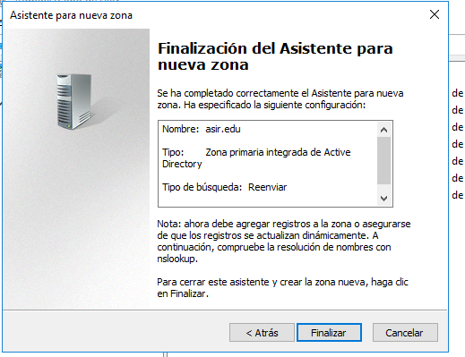

# Informe Instalación y Configuración de Servicios de Correo Electrónico en Windows 2016 Server

## Instalar Servicio SMTP en Windows 2016 Server (manualmente o utilizando Asistente).

## Configuración de servicio SMTP a través del administrador de aplicaciones (IIS) 6.0. Realizar las siguientes acciones de configuración:

Establecer como IP todas las asignadas

Limitar el número de conexiones a 50

Habilitar el registro en formato W3C, diario y en una carpeta determinada

Configurar envío de mensajes dentro de nuestra red local: Aceptar la conexión al servidor y la retransmisión de mensajes a todos los equipos menos los que aparecen en la lista

**(incluir una IP cualquiera en la lista para impedir su acceso y retransmisión)**

conexión:

retransmisión:

Establecer autenticación anónima

## Crear la exepción del firewall

exepción al puerto:

puerto 25:

permitir la conexion:

Comprobar la existencia del dominio AD predeterminado. Crea un dominio de tipo alias para disponer de cuentas en otro dominio.

Comprueba carpetas de correo creados en C:\Inetpub\mailroot.

# En el cliente Windows:

Configuración del cliente.

Comprobar acceso al nuevo nombre DNS creado en el servidor.

Enviar varios correos desde / hacia las diferentes cuentas y comprobar envío (real o ficticio) y carpetas mailroot. Las carpetas existentes en mailroot alojan mensajes en cola (Queue), mensajes para destinatarios desconocidos (Badmail) y mensajes entregados (Drop)

## En el servidor:
Nueva configuración de servicio SMTP a través del administrador de aplicaciones (IIS) 6.0. Establecer autenticación básica de Windows. Probar diferentes configuraciones de dominio predeterminado, cifrado TLS, etc.

## En el cliente Windows:
Configurar las cuentas según los parámetros especificados en el servidor. Enviar varios correos desde / hacia las diferentes cuentas y comprobar envío y carpetas mailroot. En este caso sólo tendrán acceso al servidor SMTP cuentas del dominio y correspondientes a usuarios de AD.

# ////////////////////////////////////////////////////////////////////

# Configuración de hMailServer en Windows Server

En primer lugar, hay que desinstalar el servicio SMTP de Windows 2016 Server.

Debes descargar e instalar en el servidor Windows 2016 server el servidor de correo hMailServer.

**Al instalar hMailServer, da un error con el net Framework 3.5.**

**Para instalarlo vamos a agrgar roles y caracteristicas en la admistración del servidor y lo instalamos desde ahí**

**Una vez instalado, volvemos a reinstalar hMailServer y ahora si finaliza correctamente**

**Establecemos la conexión**

Crea dos dominios denominados srd.edu y asir.edu.

Ejecuta los diagnósticos para ambos dominios y soluciona el error de backup asignando una carpeta para tal fin.
Establece copia de seguridad de los mensajes.

Ejecutamos otra vez el diagnóstico para comprobar que se ha corregio el error en los dos dominios.

Crea dos cuentas para dos usuarios ficticios en cada uno de los dos dominios. Investiga y configura las cuentas con diferentes opciones (cuota de disco, auto-reply, forwarding, signature, etc.)

**Creamos un usuario en el dominio asir.edu le configuramos la opcion de auto reply y forwarding**

**creamos otro usuario**

**Usuarios y dominios creados**

Configura el servicio DNS para crear las entradas mail.srd.edu y mail.asir.edu que apunten a la dirección ip del servidor windows 2012.

**Creamos los DNS**

**Creamos las entradas del host para MAIL.SRD.EDU**

**Creamos las entradas del host para MAIL.ASIR.EDU**

Configura en el cliente Windows un cliente de correo como thunderbird o Live Mail (en los ordenadores clientes) para acceder al servidor de correo instalado en Windows 2016.

**Descargamos el cliente de correos thunderbird**

**Añadimos las cuentas de los usuarios**

**Yo seleccione el servicio IMAP para los correos de este dominio**

**Añadimos el otro usuario**

#### Redactamos el correo

Realiza prueba de envío y recepción de correos entre los diferentes usuarios, comprobando, además de envío y recepción correctas, el efecto de las opciones configuradas en las cuentas.

**Enviamos el correo**

**Comprobamos que ha llegado**

Crea una lista de distribución empleados asociada al dominio.

Añade a los dos usuarios de miempresa.com a ella.

Realiza prueba de envío y recepción de correos por medio de la lista de distribución.

**enviamos desde lucas al mail de la lista y nos llega al correo de pepe**

