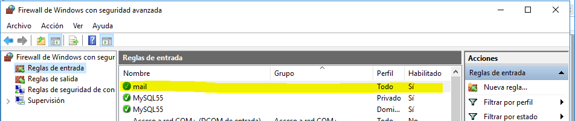

# Informe Instalación y Configuración de Servicios de Correo Electrónico en Windows 2016 Server

## Instalar Servicio SMTP en Windows 2016 Server (manualmente o utilizando Asistente).

## Configuración de servicio SMTP a través del administrador de aplicaciones (IIS) 6.0. Realizar las siguientes acciones de configuración:

Establecer como IP todas las asignadas

Limitar el número de conexiones a 50

Habilitar el registro en formato W3C, diario y en una carpeta determinada

Configurar envío de mensajes dentro de nuestra red local: Aceptar la conexión al servidor y la retransmisión de mensajes a todos los equipos menos los que aparecen en la lista

**(incluir una IP cualquiera en la lista para impedir su acceso y retransmisión)**

conexión:

retransmisión:

Establecer autenticación anónima

## Crear la exepción del firewall

exepción al puerto:

puerto 25:

permitir la conexion:

Comprobar la existencia del dominio AD predeterminado. Crea un dominio de tipo alias para disponer de cuentas en otro dominio.

Comprueba carpetas de correo creados en C:\Inetpub\mailroot.

# En el cliente Windows:

Configuración del cliente.

Comprobar acceso al nuevo nombre DNS creado en el servidor.

Enviar varios correos desde / hacia las diferentes cuentas y comprobar envío (real o ficticio) y carpetas mailroot. Las carpetas existentes en mailroot alojan mensajes en cola (Queue), mensajes para destinatarios desconocidos (Badmail) y mensajes entregados (Drop)

## En el servidor:
Nueva configuración de servicio SMTP a través del administrador de aplicaciones (IIS) 6.0. Establecer autenticación básica de Windows. Probar diferentes configuraciones de dominio predeterminado, cifrado TLS, etc.

## En el cliente Windows:
Configurar las cuentas según los parámetros especificados en el servidor. Enviar varios correos desde / hacia las diferentes cuentas y comprobar envío y carpetas mailroot. En este caso sólo tendrán acceso al servidor SMTP cuentas del dominio y correspondientes a usuarios de AD.

# //////////////////////////////////////////////////////////////////////////////

# Configuración de hMailServer en Windows Server
