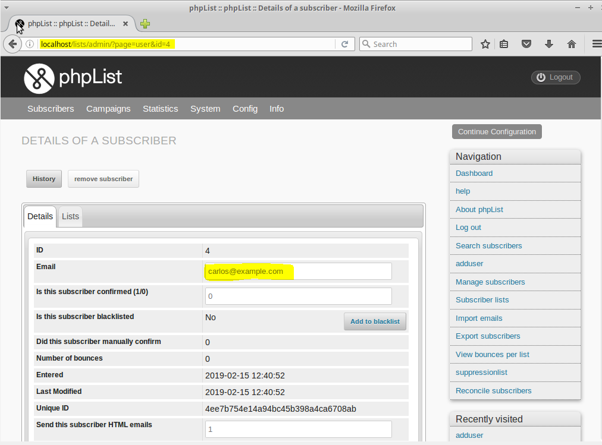
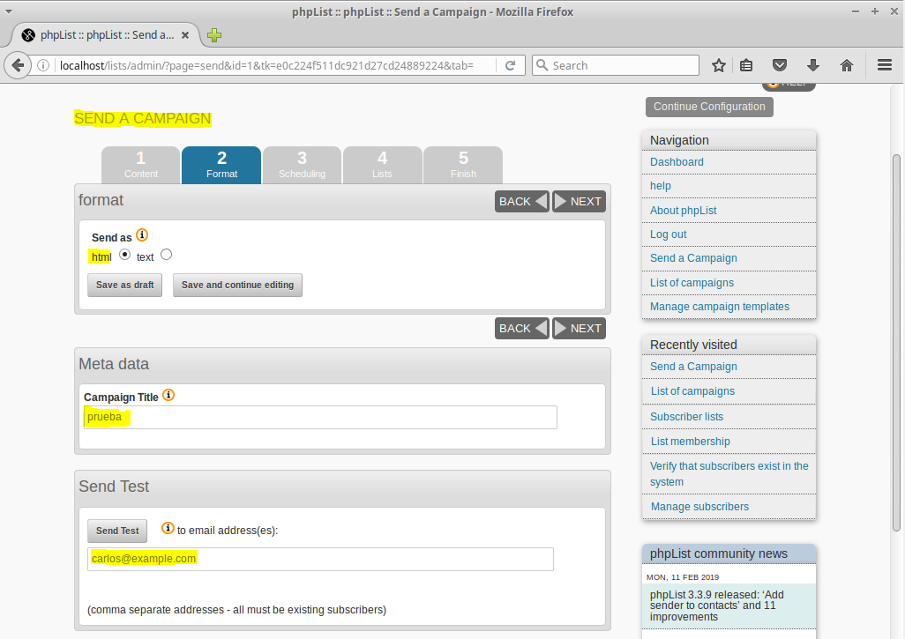

# Listas de distribución
## Introducción
En esta actividad instalaremos y activaremos un servicio de gestión de Listas de Distribución basado en el software **phpList**, creando campañas de envío masivo y págians de suscripción para posibles usuarios.

---

# phpList
## 1. Instalación
Comenzamos descargando el código fuente de `phpList` y movemos el contenido de la carpeta */lists* al directorio de nuestro servidor web */var/www/html/*

Cambiamos el usuario propietario a `www-data` y los permisos sobre dicha carpeta

Lo siguiente sería acceder a **MySQL** para crear una base de datos, un usuario con acceso a la misma y sus respectivos privilegios

Vemos el contenido final del directorio y modificamos el fichero de configuración *config/config.php*

Una vez dentro del mismo, cambiamos los parámetros preestablecidos por los nuestros correspondientes a nuestra configuración de MySQL

Teniendo esto ya hecho, ya podremos acceder desde un navegador a la interfaz gráfica de phpList en *localhost/list/admin*

Rellenamos los campos que nos son solicitados, como por ejemplo, el nombre de nuestra organización, un correo electrónico y una contraseña

Avanzamos en la instalación

Vemos como se crean las tablas en nuestro servidor de base de datos

Una vez realizado este proceso, podremos continuar con la con configuración

## 2. Configuración
Vemos los parámetros de configuración que faltan

Para ello, accedemos al panel de administración de phpList con la cuenta de administrador

Añadimos el primer usuario

Editamos los datos de `raul`

Hacemos lo mismo con `dario`

Y con `carlos`

Por otro lado, crearemos la primera lista de usuarios

Para más tarde, añadir los usuarios que acabamos de crear

Vamos a añadir los usuarios suscriptores a esta lista

Vemos los usuarios agregados

Y verificamos las lista de suscriptores totales

## 3. Campaña
A continuación, crearemos la primera campaña para enviar de forma masiva. Le asignamos un título, destinatario y contenido

Configuramos otro parámetros como un primer destinatario de prueba

Establecemos el tipo de formato del fichero de la campaña

Tenemos también la posibilidad de programar el envío de dicha campaña

Seleccionamos la lista de suscriptores a los que queremos enviarla

Finalizamos confirmando el envío

Visualizamos como se ha enviado la campaña que acabamos de crear

Ampliamos los detalles de dicha campaña

## 4. Campaña
Por último, crearemos una página de suscripción

Vamos a añadir una nueva

Editamos dicha página de suscripción a nuestro parecer, editando el código de la página *html*

Confirmamos que se ha creado la página de suscripción

