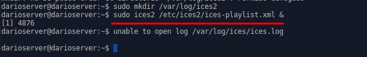
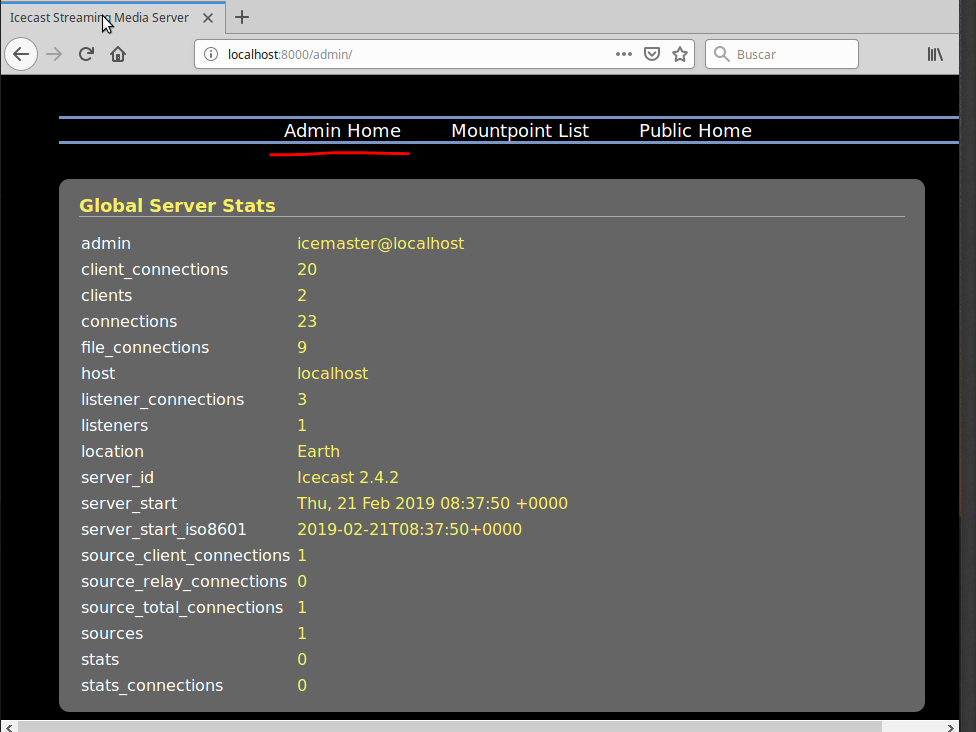

# Instalación y Configuración de un Servidor Multimedia (Audio)

## Siguiendo  los  pasos  detallados  en  las  guías  y  tutoriales  proporcionados,  vamos  a  instalar  un servicio de audio orientado a una emisión de radio musical:

Descargar e instalar el paquete IceCast (Servidor de Audio): apt-get install icecast2

Editar el fichero /etc/icecast/icecast2.xml y modificar las siguientes líneas:

**<source-password>contraseña_source</source-password>**
**<admin-user>tu_usuario</admin-user>**
**<admin-password>contraseña_administrador</admin-password>**

Editar el fichero /etc/default/icecast y modificar la siguiente línea:
**ENABLE=true**

Iniciar el servicio correspondiente a Icecast:
**$ /etc/init.d/icecast2 start**

Instalar el codificador vorbis ices2:
$ apt-get install ices2

Crear  el  directorio  para  el  codificador  y  copiar  el  fichero  de  configuración  por  defecto:
**$ mkdir /etc/ices2$**
**cp /usr/share/doc/ices2/examples/ices-playlist.xml /etc/ices2**

Editamos   el   fichero   de   configuración   del   codificador   y   establecemos   los   parámetros de nuestra emisora mediante las siguientes etiquetas:
**<name>Mi Estación de Radio</name>**
**<genre>Pop-Rock</genre>**
**<description>Radio musical dedicada al pop y al rock</description>**
**<param name=”file”>/etc/icecast2/playlist.txt</param>**
**<port>8000</port><password>tu_contraseña</password>**
**<mount>radiostation</mount>**

Recopilar  unos  cuantos  ficheros  de  audio  en  formato  ogg  y  copiarlos  en  el  directorio /tmp/música

Generar la lista de reproducción
**:$ find /tmp/música –iname “*.ogg” > /etc/icecast2/playlist.txto**

Crear el directorio log de ices2:
**$ mkdir /var/log/ices2**

Ejecutar el codificador en background:
**$ ices2 /etc/ices2/ices-playlist.xml &**

Procedemos a acceder al entorno web de información y administración de nuestro servidor de audio Icecast, a través de la IP (o nombre DNS) del servidor y el puerto configurado   anteriormente   (8000).   

Acceder   con   el   nombre   de   usuario   y   contraseña que establecimos en la configuración. Comprobar estado del servicio, configuración y propiedades.

Comprobar asimismo punto  de  montaje  (Mountpoint)  asociado  a  la  lsita  de  reproducción  creada  y  propiedades.

Acceder vía web a la lista de reproducción (mountpoint) desde el propio servidor (IPServidor:puerto/mountpoint).

Acceder  desde  un  posible  cliente  (Linux  o  Windows),  a  través  de  un  navegador,  tanto al entorno de administración como a la reproducción de la lista.

**navegador**

**administración**

Tratar  de  realizar  una  reproducción  del  streaming  de  audio  creado  utilizando  un  software reproductor multimedia desde el cliente (URL IP:puerto/mountpoint

