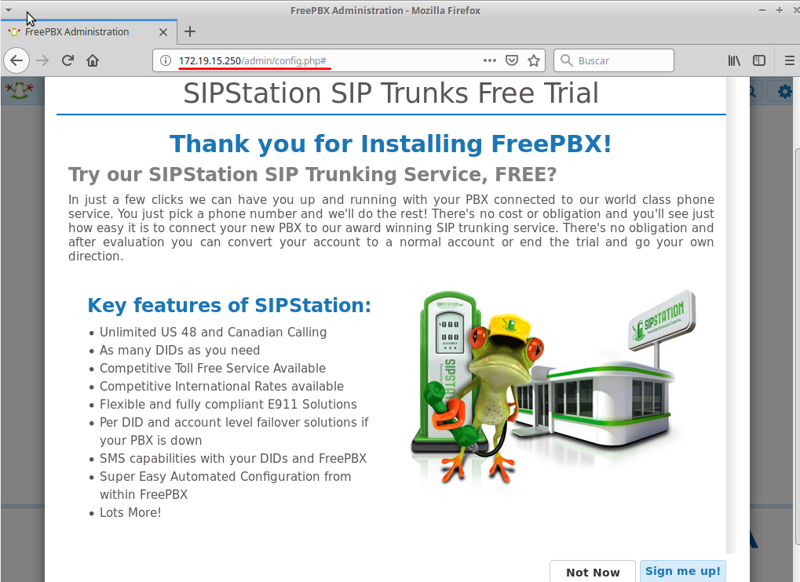

# Práctica de Linux  - SRD – 2º ASIR
# Instalación y Configuración del Servicio VoIP

### Servidor:  Descargar  e  instalar  el  PBX  open  source  Asterisk   (http://www.asterisk.org/)  y  el  gestor  de  mantenimiento  web  para  Asterisk  FreePBX (http://www.freepbx.org/).

** Instalamos la imagen de FreePBX**

Iniciamos la maquína y configuramos el usuario root

Instalación completa

Accedemos al fichero de configuración para establecer la red

**Servidor:   Siguiendo   las   prácticas   propuestas   en   las   fotocopias,   realizar   la   instalación  y  configuración  completa  del  servidor  PBX  Asterisk  y  crear,  al  menos,   dos   extensiones   correspondientes   a   dos   usuarios   con   toda   su   información, configurar los datos de la central PBX y de los usuarios a través de FreePBX**

Agregamos usuario, contraseña y demás cosas requeridas

Accedemos

Comenzamos la instalación de FreePBX

Añadimos el nombre

Se activa

Configuramos lenguaje y zona horaria

Firewall seleccionamos todo **YES**

Finaliza la instalación

Configuramos los usuarios.

Descargamos ekiga.

Configuramos los usuarios.

Los registramos.

Efectuar llamadas entre los usuarios a las extensiones creadas en el servidor. 

